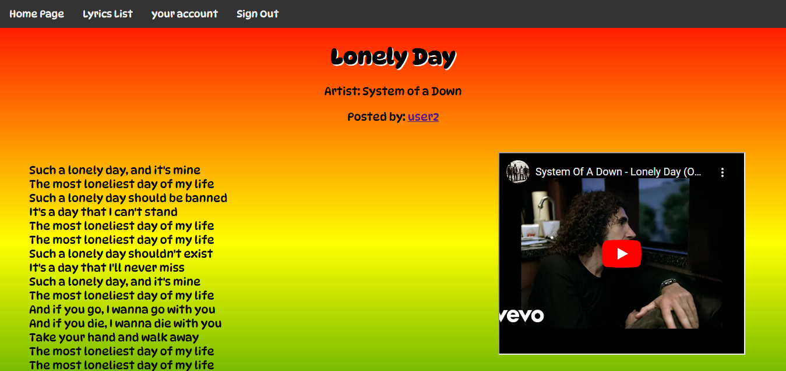

# Lyrics House

## Overview

Lyrics House is a web application that allows users to search for song lyrics and view the lyrics of their favorite songs. The application provides a user-friendly interface for searching and displaying lyrics, making it easy for users to find and enjoy their favorite songs.

## Demo

You can see the app by visiting: [here!](https://github.com/Mahdicoding1987/Lyrics-MEN-Website.git)



## Features

- ** Display lyrics:** The application displays the lyrics of the searched song, making it easy for users to read and enjoy the lyrics.
- ** The application displays the title, artist.
- ** The application displays the video of the song.
- ** Responsive design:** The application is designed to be responsive, ensuring a seamless experience across different devices and screen sizes.

## How to use

1. Open the application in your web browser.
2. Create an account
3. Click on the Sont title to display the lyrics.
4. Click on the video to display the video of the song.

## Technologies Used

* HTML5: Structure of the game.
* CSS3: Styling the game and ensuring responsive design.
* JavaScript (ES6): Game logic and interactivity.

## Prerequisites
- A web browser (Google Chrome, Firefox, or Safari)

## Strech Goals

* Add a search bar to search for songs.
* Add a feature to save favorite songs.
* Add a feature to share lyrics on social media.

## Most Challenging Part
```
router.put('/:id', async (req, res) => {
  try {
    const currentLyric = await Lyrics.findById(req.params.id);
    if (currentLyric.owner.equals(req.session.user._id)) {
      await currentLyric.updateOne(req.body);
      res.redirect(`/lyrics/${currentLyric._id}`);
    } else {
      res.redirect('/');
    }
  } catch (error) {
    console.log(error);
    res.redirect('/');
  }
});
```