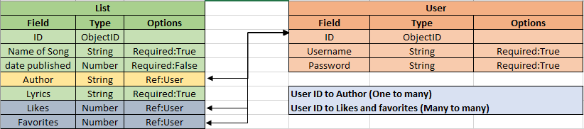

Idea description

A website to post your lyrics and read other user’s lyrics and favorite them

Mock up

Data fields
1.	Name of the song
2.	Owner 
3.	Date published
4.	The lyrics
5.	Number of likes

User stories
1.	As a user I want to able to sign up and login to the website
2.	As a user I want to able to post my lyrics
3.	As a user I want to be able to edit and delete my lyrics
4.	As a user I want to be able to like and favorite other user’s lyrics
5.	User will have own account page
6.	User will have a private favorite page 
7.	User’s posts will be posted on the Users account page

Pseudo codes
1.	Create a schema and model for our listing
2.	Require mongoose
3.	In mongoose will use referencing relations between user and 
4.	 We need to compile our schema into a model
5.	Create the controllers
6.	Export the controller
7.	Import the controller into the server
8.	Add some middleware to protect the routes
9.	Export the middleware
10.	Import the middleware in the server
11.	Create a route for all listed lyrics
12.	Create a GET route for the lyrics page
13.	Create the main Lyrics page
14.	Create a NAVBAR with the IF function for users and non-users
15.	Create a NEW page for Posting your lyrics
16.	Add a form in the NEW page
17.	Create a link in you page to access the NEW page
18.	Create a route for POST
19.	Recall the Author property on our Schema
20.	Create the Delete and update function
21.	Create the favorite Schema
22.	Create the favorite page
23.	Create the favorite function